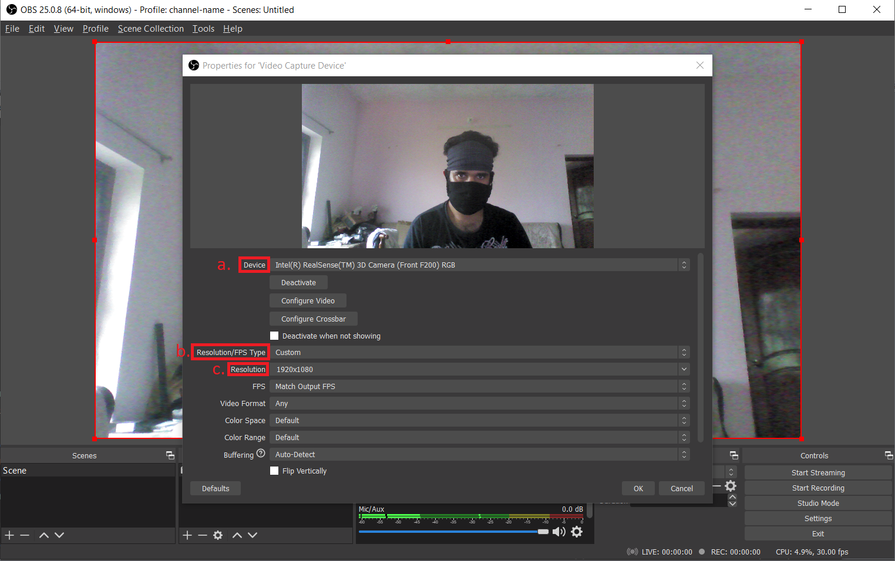

There are 2 main phases in the media app integration,

1. [Onboarding Phase](#onboarding-phase)
2. [Integration Phase](#integration-phase)

### Onboarding Phase

1. You sign up to use for Media stream app, by visiting the [onboarding page](https://media-stream.app/onboarding). Please ensure that you provide us with accurate details for fast processing
2. You'll recieve an email from `contact.us.media.stream [at] gmail [dot] com` with the subject "Welcome to Media Stream App". It may take upto 24 hours to onboard a regular user.

In the onboarding email you'll have the following important information

1. [Stream Key](glossary#stream-key)
2. [Embed Script](glossary#embed-script)

### Integration Phase

## OBS

### Profile integration

1. Open OBS.

2. Select Profile -> Import.

3. Select 'media-stream-profile.config' folder (in system folder selection screen) that is sent as an attachment in the onboarding email from media stream app team.

4. After importing, select Profile -> media-stream-profile

5. The OBS profile title changes to 'media-stream-profile' on successful Profile selection

### Streaming with laptop

#### 1. Select video capture device:

Click the + symbol under the 'Sources' section.

You should see the 'video capture device' option, click on that.

#### 2. Name the layer

When adding multiple layers it's important to ensure you label the layer.

#### 3. Select the device

- a) Select the webcam from the 'devices' drop down.
- b) Specify the 'Resolution/FPS type'.
- c) Specify the resolution from 'Resolution' dropdown, if you have selected 'custom' from 'Resolution/FPS type.

#### 4. Start streaming from laptop camera

### Streaming with external camera

#### 1. Select video capture device:

Click the + symbol under the 'Sources' section.

You should see the 'video capture device' option, click on that.

#### 2. Name the layer

When adding multiple layers it's important to ensure you label the layer.

#### 3. Select the device

- a) Select the webcam from the 'devices' drop down.
- b) Specify the 'Resolution/FPS type'.
- c) Specify the resolution from 'Resolution' dropdown, if you have selected 'custom' from 'Resolution/FPS type'.

#### 4. Optional - Adding the webcam's microphone

You'll need to manually add the webcam's microphone as an audio source in settings. Click the 'settings' button.

#### 5. Select the webcam under the audio tab

- a) Select the audio tab which is located on the left of the settings window.
- b) Under the 'Mic/Auxiliary Audio Device' dropdown select the webcam.

## HTML

### Script integration

1. Copy the 'iframe' tag from step 2 of the onboarding email received from media stream app team (will be highlighted in light blue colour in received mail).

2. Integrate the 'iframe' tag onto your code (HTML code to be specific).

3. Compile the code to observe changes. Start streaming using OBS from earlier mentioned steps and see how younew embedded solution works.

