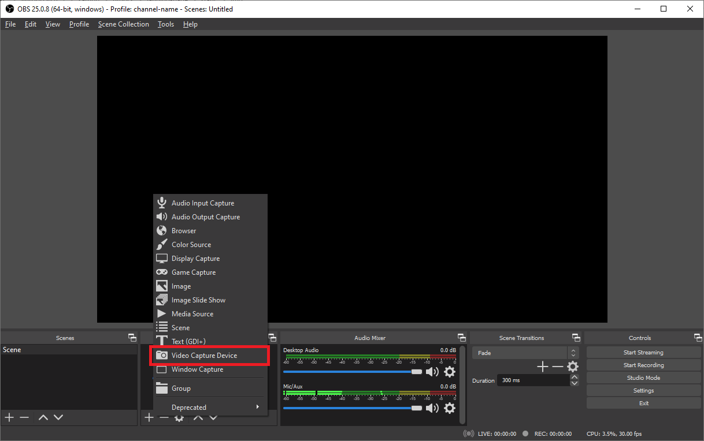

## OBS Integration

Open Broadcaster Software (OBS) is a free and open-source cross-platform streaming and recording program built with Qt and maintained by the OBS Project. As of 2016, the software is now referred to as OBS Studio.

Please ensure that you download and install OBS before proceeding. [Download OBS](https://obsproject.com/download)

### Importing Media-Stream-Profile

1. Open OBS.
2. Select Profile (in title bar) -> Import. 
3. Select 'media-stream-profile.config' folder (in system folder selection screen) that is sent as an attachment in the onboarding email. (Note: The team sends a zip file, you'll have to unzip the file before use) 
4. After importing, select Profile -> media-stream-profile 
5. The OBS profile title changes to 'media-stream-profile' on successful Profile selection 

### Streaming with laptop

 <h4 class="inline-header">Click here to read more on streaming with laptop</h4>

1. Select video capture device. Then click the + symbol under the 'Sources' section.  You should see the 'video capture device' option, click on that. 
2. Please ensure that you name your layers appropriately. Click on ok when done. 
3. Select the device  
   a. Select the webcam from the 'devices' drop down.  
   b. Specify the 'Resolution/FPS type'.  
   c. Specify the resolution from 'Resolution' dropdown, if you have selected 'custom' from 'Resolution/FPS type. 
4. Start streaming from laptop camera 

### Streaming with external camera

 <h4 class="inline-header">Click here to read more on streaming with external camera</h4>

1. Select video capture device. Then click the + symbol under the 'Sources' section.  You should see the 'video capture device' option, click on that. 
2. Name the layer. When adding multiple layers it's important to ensure you label the layer. 
3. Select the device  
   a. Select the webcam from the 'devices' drop down.  
   b. Specify the 'Resolution/FPS type'.  
   c. Specify the resolution from 'Resolution' dropdown, if you have selected 'custom' from 'Resolution/FPS type'. 
4. Optional - Adding the webcam's microphone. You'll need to manually add the webcam's microphone as an audio source in settings. Click the 'settings' button. 
5. Select the webcam under the audio tab  
   a. Select the audio tab which is located on the left of the settings window.  
   b. Under the 'Mic/Auxiliary Audio Device' dropdown select the webcam. 

## Client-side Integration

Integration of Scripts into front end application.

### Script Integration

<!--  -->

1. Copy the Embed Script from the onboarding email (will be highlighted in light blue colour in received mail).
2. Integrate the Embed Script in your markup. 
3. Publish your front end application.

## Congratulations 🎉

If you have followed the steps as mentioned, your solution should start working. Start streaming using OBS from earlier mentioned steps and see how the solution works.

